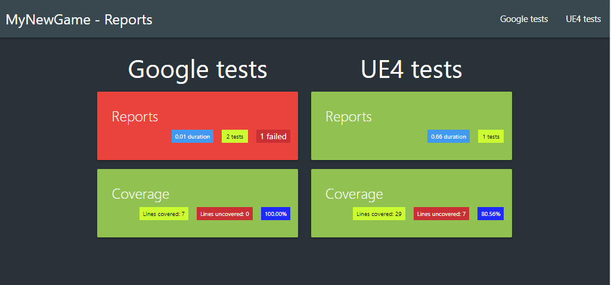
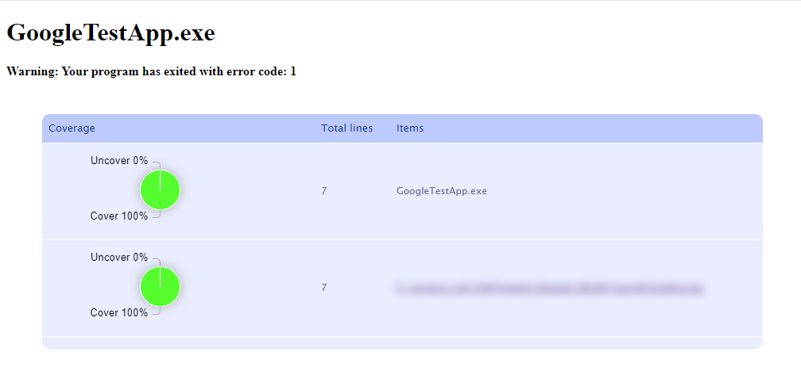
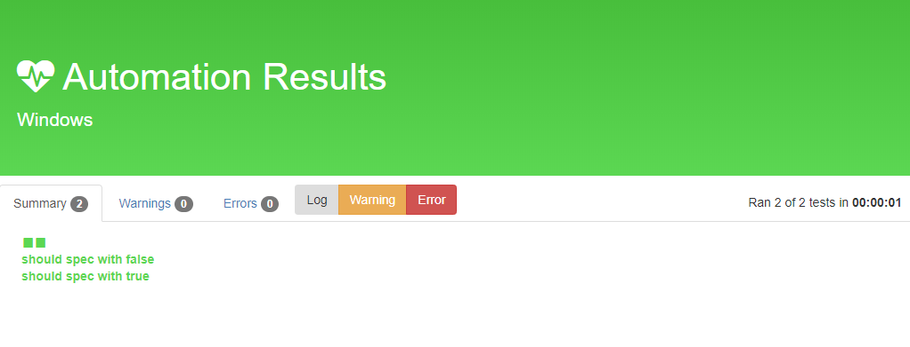

# UE4 template for c++ project with test environment
<a id="markdown-ue4-template-for-c-project-with-test-environment" name="ue4-template-for-c-project-with-test-environment"></a>


Launch your tests and code coverage with just **1** commandline + get nice reports!

> /!\ For now it works only on **Window**



|                                                                                                       <a href="https://www.buymeacoffee.com/NansUE4" target="_blank"></a>                                                                                                        |
| :----------------------------------------------------------------------------------------------------------------------------------------------------------------------------------------------------------------------------------------------------------------------------------------------------------------------------------------------------------------------------------------------: |
| I've decided to make all the code I developed for my games free to use and open source.<br> I am a true believer in the mindset that sharing and collaborating makes the world a better place.<br> The thing is: I'm fulltime dedicated to my project and these open source plugins, for coding I need a looooot of coffee, so please, help me to get my drug :stuck_out_tongue_closed_eyes: !! |

<!-- TOC -->

- [1. Why?](#1-why)
- [2. Requirements](#2-requirements)
- [3. Step by step guide](#3-step-by-step-guide)
    - [3.1. Clone to a specific dir](#31-clone-to-a-specific-dir)
    - [3.2. Rename the project files](#32-rename-the-project-files)
    - [3.3. Get submodules](#33-get-submodules)
    - [3.4. Test](#34-test)
        - [3.4.1. Filter for UE4 build](#341-filter-for-ue4-build)
        - [3.4.2. Filters for GG build](#342-filters-for-gg-build)
    - [3.5. Coverage](#35-coverage)
    - [3.6. Go to your Dashboard](#36-go-to-your-dashboard)
    - [3.7. Reinstall git + git modules on your new git repository](#37-reinstall-git--git-modules-on-your-new-git-repository)
    - [3.8. Shutdown server](#38-shutdown-server)
- [4. Debug](#4-debug)
    - [4.1. In VScode](#41-in-vscode)
    - [4.2. VS (Visual Studio)](#42-vs-visual-studio)
- [5. Formatting](#5-formatting)
    - [5.1. VS Code](#51-vs-code)
    - [5.2. VS](#52-vs)
- [6. Other scripts](#6-other-scripts)
- [7. What does it look like?](#7-what-does-it-look-like)
    - [7.1. Google Test App reports](#71-google-test-app-reports)
    - [7.2. Google Test App Coverage](#72-google-test-app-coverage)
    - [7.3. UE4 reports](#73-ue4-reports)
    - [7.4. UE4 Coverage](#74-ue4-coverage)
- [8. Contributing and Supporting](#8-contributing-and-supporting)

<!-- /TOC -->

## 1. Why?
<a id="markdown-why" name="why"></a>


My first needs were to:

* improve my process of **proof concepting**
* try to reduce the **UE4 tests build** duration
* ensure quality to avoid regressions by **running tests frequently**

Then after reading this great series of articles, testing and guiding by its author @[ericlemes](https://github.com/ericlemes):

* https://ericlemes.com/2018/12/12/unit-tests-in-unreal-pt-1/
* https://ericlemes.com/2018/12/13/unit-tests-in-unreal-pt-2/
* https://ericlemes.com/2018/12/17/unit-tests-in-unreal-pt-3/

this project came to life!

## 2. Requirements
<a id="markdown-requirements" name="requirements"></a>


* [PowerShell](https://docs.microsoft.com/en-us/powershell/)
* [Unreal Engine](https://github.com/EpicGames/UnrealEngine)
* [UE4-GoogleTest](https://github.com/NansPellicari/UE4-GoogleTest) (but it is embeded as a gitmodule)
* [OpenCppCoverage](https://github.com/OpenCppCoverage/OpenCppCoverage/wiki)
* [NodeJs](https://nodejs.org/en/download/) **v12.16.1** use [NVM for windows](https://github.com/coreybutler/nvm-windows)
* [Pm2](https://pm2.keymetrics.io/)

## 3. Step by step guide
<a id="markdown-step-by-step-guide" name="step-by-step-guide"></a>


### 3.1. Clone to a specific dir
<a id="markdown-clone-to-a-specific-dir" name="clone-to-a-specific-dir"></a>


```powershell
git clone git@github.com:NansPellicari/UE4-TPL-CppWithTestEnv.git MyNewGame
# /!\ renaming destination folder is important, because UE4 doesn't like dash in project name
cd MyNewGame
```

### 3.2. Rename the project files
<a id="markdown-rename-the-project-files" name="rename-the-project-files"></a>


```powershell
.\ChangeProjectName.bat 'MyNewGame'
# and respond "y" in every prompt
# or
.\ChangeProjectName.bat -f 'MyNewGame'
# to avoid prompts
# or
.\ChangeProjectName.bat -f 'MyPreviousGameName' 'MyNewGame'
# if you've already change the name but you decide to change again
```

This will:

* clean all unnecessary files and folders (if exists: Binaries, Saved, ...)
* prompt you to set the **UE4 root path**
* rename all `MyProject` files & folders
* change all `MyProject` occurences in `./Source/`,  `./Config/` and `./TestsReports/` directories.
* generate Project Files (for VS or VScode)

### 3.3. Get submodules
<a id="markdown-get-submodules" name="get-submodules"></a>


This repo embeds [UE4-GoogleTest](https://github.com/NansPellicari/UE4-GoogleTest) plugins which is a **UE4 plugin**, a simple bridge for the [googletest](https://github.com/google/googletest) project.

```powershell
git submodule init
git submodule update --init --recursive
```

### 3.4. Test
<a id="markdown-test" name="test"></a>


Run all tests to check if all is well configure.

```powershell
.\RunTests.bat -b gg
# this one failed intentionally
.\RunTests.bat -b ue4 MyNewGame
# last parameter is recommended for this one (see section 3.4.1.),
# otherwise it launches every UE4 tests
```

> Each run will **build** using the UE4 builder. `gg` : a **program** build, `ue4` : an **editor** build.  
> It means that the first time they are launch, they'll take time to build.  
> But on next runs you'll see how fast they are, it is such a pleasure :relaxed:  
> Special winner is the `gg` build :heart_eyes:

For the both builds ( `ue4` or `gg` ), you can filter **tests** to run.

#### 3.4.1. Filter for UE4 build
<a id="markdown-filter-for-ue4-build" name="filter-for-ue4-build"></a>


For this build it is really important to filter, otherwise it will run all Unreal Engine's tests, which is A LOT!  
You can add any filters you need as if:

```powershell
.\RunTests.bat -b ue4 MyNewGame MyPlugin.Core
```

> this will call `UE4Editor-Cmd.exe` with this parameter `-ExecCmds=" mation RunTests MyNewGame+MyPlugin. Core; quit"`

#### 3.4.2. Filters for GG build
<a id="markdown-filters-for-gg-build" name="filters-for-gg-build"></a>


Use params as [google test](https://github.com/google/googletest/blob/master/googletest/docs/advanced.md#selecting-tests) defined.

```powershell
.\RunTests.bat -c -b gg --gtest_filter=FirstTest.*-FirstTest.ShouldTestFalse
```

> to list test names: `.\RunTests.bat -b gg --gtest_list_tests`

### 3.5. Coverage
<a id="markdown-coverage" name="coverage"></a>


Just add `-c` option:

```powershell
.\RunTests.bat -c -b gg
.\RunTests.bat -c -b ue4 MyNewGame
```

### 3.6. Go to your Dashboard
<a id="markdown-go-to-your-dashboard" name="go-to-your-dashboard"></a>


I use [node](https://nodejs.org/en/download/) and [pm2](https://pm2.keymetrics.io/) to create a simple server which display all tests reports and coverages in one **dashboard**.  
Find it at `http://localhost:9999/` to see last results in a glimpse.  
Each block is a link to the more detailed reports page (see section **What does it look like?** below).


### 3.7. Reinstall git + git modules on your new git repository
<a id="markdown-reinstall-git--git-modules-on-your-new-git-repository" name="reinstall-git--git-modules-on-your-new-git-repository"></a>


```powershell
rd .\git\
rd .\Plugins\GoogleTest
git init
git submodule add git@github.com:NansPellicari/UE4-GoogleTest.git Plugins/GoogleTest
git add .
git ci -m "Initial my UE4 project with GoogleTest + OpenCppCoverage"
git remote add origin git@github.com:MY_USER/MY_REPO.git
git push origin master
```

or my preferred choice, just change the remote repository (thanks to [this](https://gist.github.com/DianaEromosele/fa228f6f6099a8996d3cb891109ab975) gist):

```powershell
git remote rm origin
git remote add origin git@github.com:MY_USER/MY_REPO.git
git config master.remote origin
git config master.merge refs/heads/master
```

### 3.8. Shutdown server
<a id="markdown-shutdown-server" name="shutdown-server"></a>


Don't forget to shutdown server when you don't use it or if you switch to other project.

```bash
cd TestsReports/
npm run server:stop
# or to ensure to kill every server
npm run server:clean
# or
pm2 delete all
```

## 4. Debug
<a id="markdown-debug" name="debug"></a>


### 4.1. In VScode
<a id="markdown-in-vscode" name="in-vscode"></a>


> When you run the script `.\GenerateProjectFiles.bat` it merge the data from `.vscode/tasks.sample.json` & `.vscode/launch.sample.json` to their respective generated config file. So if you want to add some defaults settings add them to the `.vscode/*.sample.json` files (they are versioned too).

First add a build conf in `.vscode/tasks.json` :

```json
{
	"label": "GoogleApp Win64 Development Build",
	"group": "build",
	"command": "Engine\\Build\\BatchFiles\\Build.bat",
	"args": [
		"GoogleTestApp",
		"Win64",
		"Development",
		"<YourProjectPath>\\GoogleTestApp.uproject",
		"-waitmutex"
	],
	"problemMatcher": "$msCompile",
	"type": "shell",
	"options": {
		"cwd": "<yourUE4Path>"
	}
}
```

and debug configs in your `.vscode/launch.js` :

```json
{
	"version": "0.2.0",
	"configurations": [
		// ...
		{
			"name": "GoogleApp (Development)",
			"request": "launch",
			"preLaunchTask": "GoogleApp Win[64 or 32] Development Build",
			"program": "<YourProjectPath>\\Binaries\\Win[64 or 32]\\GoogleTestApp.exe",
			"args": [],
			"cwd": "<yourUE4Path>",
			"stopAtEntry": false,
			"externalConsole": true,
			"type": "cppvsdbg",
			"visualizerFile": "<yourUE4Path>\\Engine\\Extras\\VisualStudioDebugging\\UE4.natvis"
		}
	]
}
```

### 4.2. VS (Visual Studio)
<a id="markdown-vs-visual-studio" name="vs-visual-studio"></a>


WIP

## 5. Formatting
<a id="markdown-formatting" name="formatting"></a>


### 5.1. VS Code
<a id="markdown-vs-code" name="vs-code"></a>


> The same as in [Debug](#41-in-vscode) section, you can run the script `.\GenerateProjectFiles.bat` and `.vscode/settings.sample.json` will be merged to `.vscode/settings.json` file.

To format on save and during edition, add this in your `.vscode/settings.json` :

```json
{
	"editor.formatOnSave": true,
	"editor.formatOnType": true
}
```

To make the formatter (I use [prettier](https://github.com/prettier/prettier-vscode)) recognize the json format for `.uproject` and `.plugin` files (but It should be placed on the **user** or **workspace** `settings.json` , see [this](https://github.com/prettier/prettier-vscode/issues/606#issuecomment-578085675)):

```json
{
	"files.associations": {
		"_.uproject": "json",
		"_.uplugin": "json"
	}
}
```

### 5.2. VS
<a id="markdown-vs" name="vs"></a>


WIP

## 6. Other scripts
<a id="markdown-other-scripts" name="other-scripts"></a>


A bunch of scripts can be used to help you during your development session:

| Script                       | Usage                                                                                                                                                                                                                  |
| :--------------------------- | ---------------------------------------------------------------------------------------------------------------------------------------------------------------------------------------------------------------------- |
| `.\GeneratePlugins.bat` | Copies files from the c++ Blank Project template in the Unreal Engine directory and rename it                                                                                                                          |
| `.\Clean.bat` | Removes all generated files and folder                                                                                                                                                                                 |
| `.\GenerateProjectFiles.bat` | - Uses `Clean.bat` <br>- Uses `<ue4 rootpath>Engine\Binaries\DotNET\UnrealBuildTool.exe` to generate VS or VSCode files from the .uproject file<br>- Download npm dependencies in the TestsReports folder + clean and start nodejs report's server<br>- Merge `.vscode/*.sample.json` > generated `.vscode/*.json` files |
| `.\Scripts\RenameFileAndContent.ps1` | _(powershell file)_ In a given directory, change recursively files, folder, contents, from and to given names, usages:<br> `.\Scripts\RenameFileAndContent.ps1 .\Plugins\Dir\ AClassNameIWantToChange TheNewClassName` |

## 7. What does it look like?
<a id="markdown-what-does-it-look-like" name="what-does-it-look-like"></a>


### 7.1. Google Test App reports
<a id="markdown-google-test-app-reports" name="google-test-app-reports"></a>


I choose to use [Xunit viewer](https://www.npmjs.com/package/xunit-viewer) because (at the age of this repo creation):

* it is actively maintain
* is the most advanced UI on npm


### 7.2. Google Test App Coverage
<a id="markdown-google-test-app-coverage" name="google-test-app-coverage"></a>




### 7.3. UE4 reports
<a id="markdown-ue4-reports" name="ue4-reports"></a>




### 7.4. UE4 Coverage
<a id="markdown-ue4-coverage" name="ue4-coverage"></a>


[License Apache-2.0](./LICENSE.md)

## 8. Contributing and Supporting
<a id="markdown-contributing-and-supporting" name="contributing-and-supporting"></a>


I've decided to make all the code I developed for my games free to use and open source.  
I am a true believer in the mindset that sharing and collaborating makes the world a better place.  
I'll be very glad if you decided to help me to follow my dream.

| How?                                                                                                                                                                            |                                                                                         With                                                                                         |
| :------------------------------------------------------------------------------------------------------------------------------------------------------------------------------ | :----------------------------------------------------------------------------------------------------------------------------------------------------------------------------------: |
| **Donating**<br> Because I'm an independant developer/creator and for now I don't have<br> any income, I need money to support my daily needs (coffeeeeee).                      | <a href="https://www.buymeacoffee.com/NansUE4" target="_blank"></a> |
| **Contributing**<br> You are very welcome if you want to contribute. I explain [here](./CONTRIBUTING.md) in details what<br> is the most comfortable way to me you can contribute. |                                                                         [CONTRIBUTING.md](./CONTRIBUTING.md)                                                                         |
